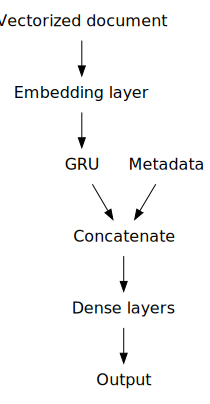

---
addenda:
- '[code](https://github.com/alexklapheke/essay)'
- |
    [slide
    deck](https://github.com/alexklapheke/essay/blob/master/presentation/presentation.pdf)
date: 1594592444
title: Automated essay scoring
---

::: {.epigraph}
'Tis hard to say, if greater Want of Skill\
Appear in Writing or in Judging ill
:::

# Prolegomenon

[Automated Essay
Scoring](https://en.wikipedia.org/wiki/Automated_essay_scoring) has been
contemplated as an application of machine learning since its earliest
days. The ETS began using its proprietary
[e-rater](https://www.ets.org/erater/about) in 1999, which, with a human
cohort, now grades the SAT essay. In 2012, the Hewlitt Foundation
sponsored the [Automated Student Assessment
Prize](https://www.kaggle.com/c/asap-aes) (ASAP), offering a \$100,000
reward for the best scoring system. Not long after,
@shermis2013contrasting found that automated scoring systems performed
similarly to human graders, a claim met with both
[praise](https://www.insidehighered.com/news/2012/04/13/large-study-shows-little-difference-between-human-and-robot-essay-graders)
and
[skepticism](https://www.nytimes.com/2012/04/23/education/robo-readers-used-to-grade-test-essays.html).
Les Perelman, for example, inveighed that e-rater looked for particular
stylistic cues without considering their rhetorical effect:

> E-Rater, \[Perelman\] said, does not like short sentences.
>
> Or short paragraphs.
>
> Or sentences that begin with "or." And sentences that start with
> "and." Nor sentence fragments.
>
> However, he said, e-Rater likes connectors, like "however," which
> serve as programming proxies for complex thinking. Moreover,
> "moreover" is good, too.
>
> Gargantuan words are indemnified because e-Rater interprets them as a
> sign of lexical complexity. "Whenever possible," Mr. Perelman advises,
> "use a big word. 'Egregious' is better than 'bad.'"

And in a more thorough rejoinder [-@perelman2013critique], Perelman
contests the statistical results as cherry-picked:

> The clearest omission is the failure of the authors to report the
> fairly large percentage of machine values for the Pearson $r$ and the
> Quadratic Weighted Kappa that fell below the minimum standard of 0.7.
> \[...\] Any value below 0.7 will be predicting significantly less than
> half the population and, because this is an exponential function,
> small decreases in value produce large decreases in the percentage
> accurately predicted. \[...\] Yet for the Quadratic Weighted Kappa, 28
> of the 81 machine scores, 35.6%, are below the minimally acceptable
> level of 0.7, even though the machines had the advantage in half of
> the essay sets of matching an inflated Resolved Score. In contrast,
> the human readers, who had to match each other with no artificial
> advantage, had only one Quadratic Weighted Kappa below 0.7, for the
> composite score on essay set \#8 or only 1 out of 9 or 11.1%.

Besides these issues, and the ethics of eschewing a human reader's eye,
criticism of these systems has focused on the ease of gaming them, such
as @powers2002stumping, who managed to finagle higher scores from
e-rater than humans were willing to grant (though not lower scores).
Perelman himself, in response to a prompt about whether "the rising cost
of a college education is the fault of students who demand \[...\]
luxuries", wrote an essay, excerpted below, which despite earning
e-rater's highest possible score of 6, is laden with solecisms, factual
errors, and non sequiturs, including a full line of Allen Ginsberg's
"Howl" (the full essay is reproduced in [Appendix
A](#appendix-a-perelmans-2012-essay)):

> I live in a luxury dorm. In reality, it costs no more than rat
> infested rooms at a Motel Six. The best minds of my generation were
> destroyed by madness, starving hysterical naked, and publishing
> obscene odes on the windows of the skull. Luxury dorms pay for
> themselves because they generate thousand and thousands of dollars of
> revenue. In the Middle Ages, the University of Paris grew because it
> provided comfortable accommodations for each of its students, large
> rooms with servants and legs of mutton. Although they are expensive,
> these rooms are necessary to learning. The second reason for the
> five-paragraph theme is that it makes you focus on a single topic.
> Some people start writing on the usual topic, like TV commercials, and
> they wind up all over the place, talking about where TV came from or
> capitalism or health foods or whatever. But with only five paragraphs
> and one topic you're not tempted to get beyond your original idea,
> like commercials are a good source of information about products. You
> give your three examples, and zap! you're done. This is another way
> the five-paragraph theme keeps you from thinking too much.

With the above criticisms leveled, I should disclaim that I am training
a model to *predict essay scores*, not to *score essays*, which is a
much harder task (and should be held to a much higher standard) and not
an obviously meaningful thing to ask of a mathematical model to begin
with. However, the results show that much---even if not all---of what
constitutes an essay grade is not the *je ne sais quoi* only a human
evaluator can glimpse, but rather mechanical issues that can be
straightforwardly calculated and modeled.

# Data exploration & cleaning[^1] {#sec:dataexp}

## Essay set selection

The corpus is in the form of 13,000 essays, totaling 2.9 million
words---more than twice the length of Proust's *In Search of Lost Time*.
The length, however, was not as immediate an obstacle as the
composition, shown in @tbl:sets. The eight essay sets were not only
responding to different prompts, but were of different lengths and
genres, written by students of different grade levels, and, most
importantly, scored using incommensurate rubrics and scoring protocols.

  Essay set   Grade level   Genre        Train size   Test size   Avg. length   Rubric range   Resolved score range   Adjudication
  ----------- ------------- ------------ ------------ ----------- ------------- -------------- ---------------------- ---------------------------------------
  1           8             Persuasion   1,785        592         350           1--6           2--12                  Sum if adjacent, else third scorer
  2           10            Persuasion   1,800        600         350           1--6, 1--4     1--6, 1--4             First
  3           10            Exposition   1,726        575         150           0--3           0--3                   Higher if adjacent, else third scorer
  4           10            Exposition   1,772        589         150           0--3           0--3                   Higher if adjacent, else third scorer
  5           8             Exposition   1,805        601         150           0--4           0--4                   Higher
  6           10            Exposition   1,800        600         150           0--4           0--4                   Higher
  7           7             Narrative    1,730        576         250           0--15          0--30                  Sum
  8           10            Narrative    918          305         650           0--30, 0--30   0--60                  Sum if adjacent, else third scorer

  : Summary of the essay sets in the ASAP corpus. "Rubric range" and
  "resolved range" are scores before and after adjudication,
  respectively. Adjudication rules have been simplified {\#tbl:sets}

Limiting myself to a single essay set would have produced a somewhat
feeble model, as words idiosyncratic to the topic in question became
artificially elevated in importance. In the end, I combined sets 3 and
4, which both consisted of expository essays written by tenth graders,
graded on a scale from 0 (worst) to 3 (best). These scores are holistic,
i.e., not broken down into categories representing grammar and
mechanics, relevance, organization, etc., which makes them easier for a
model to predict.

## Data cleaning

The scores are broken down, for each essay set, into "domain scores"
representing the valuations of the individual scorers. In the interest
of having a single number to try to predict, I combined these scores by
taking the mean:

``` {.python}
# If only one score exists, use that. Otherwise, take the mean of both scores.
essays["score"] = list(map(np.nanmean, zip(essays["domain1_score"], essays["domain2_score"])))
```

We can then look at the way scores are distributed among the essays in
our chosen subset.

{#fig:score}

In @fig:score, we see that the scorers of the fourth essay set were
somewhat less lenient than those grading the third, the latter of whom
awarded the highest score to a full quarter of the papers, and the
lowest score of 0 to only 39 unhappy test-takers. Putting these
together, we have a roughly normal-looking distribution, with many ones
and twos, and fewer zeroes and threes. This gives us a baseline to use
for the modeling below: a dumb model, which assigned every essay to the
plurality score class, giving every essay a score 1, would have an
accuracy of 35%. This is the number our models must beat.

The essays themselves are in little need of cleaning: they are
hand-transcribed from the originals, and have been anonymized by
replacing named entities, including names, dates, addresses, and
numbers, with enumerated placeholders.

## Data exploration[^2]

A basic exploration of the essays shows some striking patters. For
example, as @fig:length illustrates, score is highly correlated with
length at $R^2 = 0.51$, meaning that over half the variation in score
can be explained by variation in length. In other words, all else held
equal, adding 82 words corresponds with a point increase in score.

{#fig:length}

One interesting thing we see is that, despite the correlation, there are
many essays earning top marks that are almost impossibly short. The
following are recorded in the dataset as having earned a top score (both
prompts instructed students to use examples from the texts):

> The features of the setting affect the cyclist in many ways. It made
> him tired thirsty and he was near exaustion \[sic\].[^3]

> Because she saying when the \@CAPS1 grow back she will be \@CAPS2 to
> take the test again.[^4]

> Reserved need to check keenly[^5]

That that gnomic last "essay" (yes, that's the whole text!) earned a
coveted score of 3 is almost certainly an error, though the source of
the error (the recording of the scores, the compilation of the dataset,
or the scoring process itself) is as mysterious as the cryptic phrase's
meaning. However, there doesn't seem to be an objective way of pruning
these aberrant rows from the dataset, necessitating my leaving them in.

Other measures are telling as well. For instance, we can look at the
rate of misspelled words, by tokenizing with spaCy, and counting each
token that is not in a given wordlist.[^6]

``` {.python}
import spacy
nlp = spacy.load("en")

# Generate wordlist
with open("/usr/share/dict/words" , "r") as infile:
    wordlist = set(infile.read().lower().strip().split("\n"))

# Number of words that are misspelled
essays["misspellings"] = len([word for word in nlp(essays["essay"])
     if not word.is_space
     and not word.is_punct
     and not word.text.startswith("@") # named entities
     and not word.text.startswith("'") # contractions
     and word.text.lower() not in wordlist])

# Percentage of words misspelled
essays["misspellings"] /= essays["tokens"]
```

The results, in @fig:missp, are curiously complementary to those in
@fig:length: the rate of misspellings is practically the same across
score classes ($R^2 = 0.002$), but those at the extremes, with 10% or
more of their words misspelled, are overwhelmingly likely to be low
scorers.

{#fig:missp}

The question of assessing prompt-relevance is trickier. One way of
tackling it is to calculate the document vector of the story to which
the students are responding, and calculate its [cosine
similarity](https://en.wikipedia.org/wiki/Cosine_similarity) with the
document vector of each essay. We can see the results in @fig:prompt.

{#fig:prompt}

The results aren't bad ($R^2 = 0.28$), especially considering the
outliers for score 3 are the same bizarrely short essays we saw above,
including our Delphic "reserved need to check keenly".

At this point, we must ask what the value of this metadata is. The ETS
[claims](https://www.ets.org/research/topics/as_nlp/writing_quality/)
that its e-rater accounts for prompt-relevance, as well as:

> -   errors in grammar (e.g., subject--verb agreement)
> -   usage (e.g., preposition selection)
> -   mechanics (e.g., capitalization)
> -   style (e.g., repetitious word use)
> -   discourse structure (e.g., presence of a thesis statement, main
>     points)
> -   vocabulary usage (e.g., relative sophistication of vocabulary)
> -   sentence variety
> -   source use
> -   discourse coherence quality

While it would take a sophisticated natural language parser to
incorporate these details into our model, we may be able to approximate
these things using metadata as proxies. Type--token ratio, for instance,
could stand in for "repetitious word use", and vector similarity to the
prompt for relevance. As an alternative to parsing for narrative
structure, I included a count of "linking words" that would likely
signal a transition between paragraphs,[^7] but this bore little
relationship to the human scorers' judgments ($R^2 = 0.0004$). Finally,
as a proxy for sentence complexity, I used spaCy to parse the syntactic
trees of each sentence, and took the longest branch, thus rewarding
complex sentences with prepositional phrases and dependent clauses.

``` {.python}
# Depth of longest branch in dependency tree
essays["max_depth"] = [max([len(list(token.children))
                       for token in nlp(essay)])
                       for essay in essays["essay"]]
```

This fared somewhat better as a metric: $R^2 = 0.13$. Finally, I tried
to measure "relative sophistication of vocabulary" by quantifying the
uncommonness of the words used. I did this by building a word frequency
list from the 14-million-word [American National
Corpus](http://www.anc.org/), the details of which are in [Appendix
B](#appendix-b-anc-wordlist). This correlated well with score
($R^2 = 0.40$), although it was no doubt standing in somewhat for
length.

# Modeling

## Classical models[^8] {#sec:class}

As hinted at by the high $R^2$ scores above, we can get fair prediction
scores by modeling on metadata alone. The first step, after splitting
our essays into train and test sets, is to standardize the data by
scaling to $z$-score. I then ran principal component analysis (PCA) on
the data, because many of the columns (e.g., type count and token count)
encoded essentially the same information in parallel. The PCA
transformation extracts those components which encode the greatest
variance; together, the ten components extracted accounted for 98% of
the variance within the metadata.

``` {.python}
from sklearn.model_selection import train_test_split
from sklearn.preprocessing import StandardScaler
from sklearn.decomposition import PCA

# Split into train and test sets
X_train, X_test, y_train, y_test = train_test_split(X, y)

# Standardize to z-score
ss = StandardScaler()
X_train_sc = ss.fit_transform(X_train))
X_test_sc = ss.transform(X_test))

# PCA-transform
pca = PCA(n_components=10)
Z_train = pca.fit_transform(X_train_sc)
Z_test = pca.transform(X_test_sc)
```

The modeling itself is fairly straightforward. I modeled the data both
with and without the PCA transform, and found the latter to have a
slight edge, although all models achieved similar test scores
(@tbl:models).

``` {.python}
from sklearn.naive_bayes import GaussianNB
from sklearn.svm import SVC
from sklearn.ensemble import AdaBoostClassifier, ExtraTreesClassifier
from sklearn.metrics import cohen_kappa_score

gnb = GaussianNB().fit(Z_train, y_train)
svm = SVC(kernel="rbf", C=1).fit(Z_train, y_train)
ext = ExtraTreesClassifier().fit(Z_train, y_train)
ada = AdaBoostClassifier().fit(Z_train, y_train)

for model in [gnb, svm, ext, ada]:
    print("Test score:", model.score(X_test_sc, y_test))
    print("Test kappa:", cohen_kappa_score(model.predict(X_test_sc), y_test),
                                           weighting="quadratic")
```

I also included the weighted Cohen's kappa [@cohen1960a], which was the
metric used for the original competition, although Cohen's kappa is
typically used to compare model results to each other, not to a gold
standard.

  Model                    Test acc.   PCA test acc.   Test $\kappa$   PCA Test $\kappa$
  ------------------------ ----------- --------------- --------------- -------------------
  Naïve Bayes              59.8%       59.3%           0.710           0.613
  Support vector machine   65.1%       63.6%           0.690           0.674
  ExtraTrees               63.7%       62.4%           0.695           0.679
  AdaBoost                 60.0%       56.8%           0.664           0.670

  : Results of some classical models vs. 35% baseline accuracy
  {\#tbl:models}

The support vector machine and ExtraTrees models performed slightly
better than their rivals, and in fact made similar predictions to each
other ($\kappa = 0.81$). We should also take into account that on essay
sets 3 and 4, human graders agreed only about 75% of the time, with a
weighted Cohen's kappa of 0.77 and 0.85, respectively
[@shermis2013contrasting, p. 316].

## Recurrent Neural Network[^9]

One of the state of the art tools in text processing is the recurrent
neural network, into which ordered data is fed in series, and the model
is retrained on prior data, in order to learn things about the sequence.
The first step to doing this with word data is to convert the words to
numerical indices (so "a" becomes 1, "aardvark" becomes 2, "Aaron"
becomes 3, etc.), then padding them to be of equal length.

``` {.python}
from tensorflow.keras.preprocessing.sequence import pad_sequences

# Define vocabulary
vocab = set(token.text for essay in essays["essay"] for token in nlp.tokenizer(essay))

# Convert words to numerical indices <https://www.tensorflow.org/tutorials/text/text_generation>
word2idx = {u: i for i, u in enumerate(vocab)}

# Convert essays to vectors of indices
X_vector = [[word2idx[token.text]
            for token in nlp.tokenizer(essay)]
            for essay in essays["essay"]]

# Create padded sequences
X_vector = pad_sequences(X_vector)

# Split into train and test sets
X_vector_train, X_vector_test = train_test_split(X_vector);
```

This then goes into an embedding layer, which condenses it into a dense
vector.

With neural networks, it is possible to include both the vectorized
document and the metadata, by processing the former in a
[GRU](https://en.wikipedia.org/wiki/Gated_recurrent_unit) or
[LSTM](https://en.wikipedia.org/wiki/Long_short-term_memory) layer,
concatenating the latter to its output neurons, and processing both in a
regular perceptron structure [See, e.g., @xing2017incorporating].
Following the example in [this blog
post](https://www.digital-thinking.de/deep-learning-combining-numerical-and-text-features-in-deep-neural-networks/),
I implemented the code below:[^10]

``` {.python}
from tensorflow.keras.layers import Dense, GRU, Embedding, Input, Bidirectional, Concatenate
from tensorflow.keras.models import Model

# Define inputs
vector_input = Input(shape=(X_vector.shape[1],)) # Text vectors, in series of length 1,000
meta_input = Input(shape=(X_meta.shape[1],)) # Scaled metadata (types, tokens, etc.)

# Embedding layer turns lists of word indices into dense vectors
rnn = Embedding(
        input_dim = len(vocab),
        output_dim = 128,
        input_length = X_vector.shape[1],
    )(vector_input)

# GRU layers for RNN
rnn = Bidirectional(GRU(128, return_sequences=True, kernel_regularizer=l2(0.01)))(rnn)
rnn = Bidirectional(GRU(128, return_sequences=False, kernel_regularizer=l2(0.01)))(rnn)

# Incorporate metadata
rnn = Concatenate()([rnn, meta_input])

# Define hidden and output layers
rnn = Dense(128, activation="relu", kernel_regularizer=l2(0.01))(rnn)
rnn = Dense(128, activation="relu", kernel_regularizer=l2(0.01))(rnn)
rnn = Dense(4, activation="softmax")(rnn)

# Define model
model = Model(inputs=[vector_input, meta_input], outputs=[rnn])

# Fit model
model.fit([X_vector_train, X_meta_train_sc], y_train,
          validation_data=([X_vector_test, X_meta_test_sc], y_test))
```

The results are surprisingly close to the models in @sec:class above.
Amending our previous table:

  Model                    Test acc.   Test $\kappa$
  ------------------------ ----------- ---------------
  Naïve Bayes              59.8%       0.710
  Support vector machine   65.1%       0.690
  ExtraTrees               63.7%       0.695
  AdaBoost                 60.0%       0.664
  RNN                      63.6%       0.704

  : Comparison of all models vs. 35% baseline accuracy {\#tbl:rnn}

It seems that the metadata was more valuable in predicting test scores
than the vectorized documents---or else, that the RNN couldn't make
better use of the two than a support vector machine could of the one.
Nevertheless, I have shown that using a few key linguistic metrics, we
can train a simple model to predict essay scores in fairly good
agreement with human scorers.

# Appendix A: Perelman's (2012) essay {#appendix-a-perelmans-2012-essay .unnumbered}

Prompt:

> Question: "The rising cost of a college education is the fault of
> students who demand that colleges offer students luxuries unheard of
> by earlier generations of college students---single dorm rooms,
> private bathrooms, gourmet meals, etc."
>
> Discuss the extent to which you agree or disagree with this opinion.
> Support your views with specific reasons and examples from your own
> experience, observations, or reading.

Response:

> In today's society, college is ambiguous. We need it to live, but we
> also need it to love. Moreover, without college most of the world's
> learning would be egregious. College, however, has myriad costs. One
> of the most important issues facing the world is how to reduce college
> costs. Some have argued that college costs are due to the luxuries
> students now expect. Others have argued that the costs are a result of
> athletics. In reality, high college costs are the result of excessive
> pay for teaching assistants.
>
> I live in a luxury dorm. In reality, it costs no more than rat
> infested rooms at a Motel Six. The best minds of my generation were
> destroyed by madness, starving hysterical naked, and publishing
> obscene odes on the windows of the skull. Luxury dorms pay for
> themselves because they generate thousand and thousands of dollars of
> revenue. In the Middle Ages, the University of Paris grew because it
> provided comfortable accommodations for each of its students, large
> rooms with servants and legs of mutton. Although they are expensive,
> these rooms are necessary to learning. The second reason for the
> five-paragraph theme is that it makes you focus on a single topic.
> Some people start writing on the usual topic, like TV commercials, and
> they wind up all over the place, talking about where TV came from or
> capitalism or health foods or whatever. But with only five paragraphs
> and one topic you're not tempted to get beyond your original idea,
> like commercials are a good source of information about products. You
> give your three examples, and zap! you're done. This is another way
> the five-paragraph theme keeps you from thinking too much.
>
> Teaching assistants are paid an excessive amount of money. The average
> teaching assistant makes six times as much money as college
> presidents. In addition, they often receive a plethora of extra
> benefits such as private jets, vacations in the south seas, a staring
> roles in motion pictures. Moreover, in the Dickens novel Great
> Expectation, Pip makes his fortune by being a teaching assistant. It
> doesn't matter what the subject is, since there are three parts to
> everything you can think of. If you can't think of more than two, you
> just have to think harder or come up with something that might fit. An
> example will often work, like the three causes of the Civil War or
> abortion or reasons why the ridiculous twenty-one-year-old limit for
> drinking alcohol should be abolished. A worse problem is when you wind
> up with more than three subtopics, since sometimes you want to talk
> about all of them.
>
> There are three main reasons while Teaching Assistants receive such
> high remuneration. First, they have the most powerful union in the
> United States. Their union is greater than the Teamsters or
> Freemasons, although it is slightly smaller than the international
> secret society of the Jedi Knights. Second, most teaching assistants
> have political connections, from being children of judges and
> governors to being the brothers and sisters of kings and princes. In
> Heart of Darkness, Mr. Kurtz is a teaching assistant because of his
> connections, and he ruins all the universities that employ him.
> Finally, teaching assistants are able to exercise mind control over
> the rest of the university community. The last reason to write this
> way is the most important. Once you have it down, you can use it for
> practically anything. Does God exist? Well, you can say yes and give
> three reasons, or no and give three different reasons. It doesn't
> really matter. You're sure to get a good grade whatever you pick to
> put into the formula. And that's the real reason for education, to get
> those good grades without thinking too much and using up too much
> time.
>
> In conclusion, as Oscar Wilde said, "I can resist everything except
> temptation." Luxury dorms are not the problem. The problem is greedy
> teaching assistants. It gives me an organizational scheme that looks
> like an essay, it limits my focus to one topic and three subtopics so
> I don't wander about thinking irrelevant thoughts, and it will be
> useful for whatever writing I do in any subject.1 I don't know why
> some teachers seem to dislike it so much. They must have a different
> idea about education than I do. By Les Perelman

# Appendix B: ANC wordlist {#appendix-b-anc-wordlist .unnumbered}

The following code generates the
[wordlist](https://github.com/alexklapheke/essay/blob/master/data/anc_frequency_list.csv)
I used (see @sec:dataexp). It took about 15 minutes to run. The ANC data
is available from [anc.org](https://www.anc.org), and is, per that
website, "fully open and unrestricted for any use". The resulting
wordlist obeys [Zipf's law](https://en.wikipedia.org/wiki/Zipf%27s_law),
as shown in @fig:zipf, and is part-of-speech tagged, so homographs of
different frequencies (e.g., saw~V~ vs. saw~N~) can be distinguished.

{#fig:zipf}

The actual frequency measure used was the sum of word token ranks. While
this gave higher results for longer sentences, and was therefore
intercorrelated with token length, a very uncommon word could give the
score an order-of-magnitude boost.

``` {.python}
#!/usr/bin/env python3

# Libraries
import glob
import spacy
from unidecode import unidecode

# Options
anc_path = "/home/alex/Data/ANC/"  # freely downloadable from anc.org
dict_path = "/usr/share/dict/words"  # wamerican-insane v2017.08.24-1
freq_per = 100_000  # scaling factor (i.e., compute freq. per this many words)
include_hapaxes = True

# Initialize spaCy
nlp = spacy.load("en")

freqs = {}
total_tokens = 0

with open(dict_path, "r") as file:
    dictionary = set(file.read().split("\n"))

# Get all text files recursively <https://stackoverflow.com/a/45172387>
for filename in glob.iglob(anc_path + "**/*.txt", recursive=True):

    # Open each file in the corpus
    with open(filename, "r") as file:

        # Remove diacritics, parse, & tokenize
        for token in nlp(unidecode(file.read())):

            # Eliminate non-words
            if not token.is_punct and not token.is_space:

                # Lemmatize and remove diacritics/ligatures
                lemma = token.lemma_.lower().strip("-")

                # Only use dictionary words
                if lemma in dictionary:

                    # Add lemma/part-of-speech tag
                    type_pos = ",".join([lemma, token.pos_])

                    # Update our dictionary
                    freqs[type_pos] = freqs.setdefault(type_pos, 0) + 1

                    # Update our running total
                    total_tokens += 1

print("{:,} tokens,".format(total_tokens),
      "{:,} types".format(len(freqs.keys())))

# <https://stackoverflow.com/a/9001529>
freqs_sorted = dict(sorted(freqs.items()))

with open("anc_frequency_list.csv", "w") as file:

    # CSV header
    file.write(f"lemma,pos,count,freq_per_{freq_per}\n")

    # CSV rows
    for word, freq in freqs_sorted.items():
        if include_hapaxes or freq > 1:
            file.write(f"{word},{freq},{freq_per*freq/total_tokens}\n")
```

[^1]: [Relevant
    notebook](https://github.com/alexklapheke/essay/blob/master/code/0-Parse_data-EDA.ipynb)

[^2]: [Relevant
    notebook](https://github.com/alexklapheke/essay/blob/master/code/2-Hypothesis-tests.ipynb)

[^3]: Essay no. 6332, set 3

[^4]: Essay no. 10057, set 4

[^5]: Essay no. 9870, set 4

[^6]: I used [wamerican-insane
    v2017.08.24-1](https://packages.ubuntu.com/bionic/wamerican-insane),
    which contains 654,749 entries.

[^7]: Phrases culled from Wiktionary
    ([1](https://en.wiktionary.org/wiki/Category:English_conjunctive_adverbs),
    [2](https://en.wiktionary.org/wiki/Category:English_sequence_adverbs)).
    The full list:

    > accordingly, additionally, alphabetically, alphanumerically, also,
    > alternatively, antepenultimately, anyway, at any rate, before,
    > besides, by the way, chronologically, consequently, conversely,
    > eighthly, either, eleventhly, equally, fifthly, fiftiethly,
    > finally, first, first of all, first off, first up, firstly, for
    > another thing, for example, for instance, for one thing,
    > fortiethly, fourthly, further, furthermore, hence, however,
    > hundredthly, in addition, in other words, in the first place,
    > incidentally, indeed, lastly, likewise, moreover, neither,
    > nevertheless, next, nextly, ninthly, nonetheless, on the contrary,
    > on the gripping hand, on the one hand, on the other hand,
    > otherwise, parenthetically, penultimately, rather, secondly,
    > serially, seventhly, similarly, sixthly, sixtiethly, still,
    > tenthly, that is, that is to say, then again, therefore, thirdly,
    > thirteenthly, thirtiethly, though, thus, to that end, too,
    > twelfthly, twentiethly, wherefore

[^8]: [Relevant
    notebook](https://github.com/alexklapheke/essay/blob/master/code/3-Model_data.ipynb)

[^9]: [Relevant
    notebook](https://github.com/alexklapheke/essay/blob/master/code/4-Neural_net.ipynb)

[^10]: The schema is,
    roughly:
