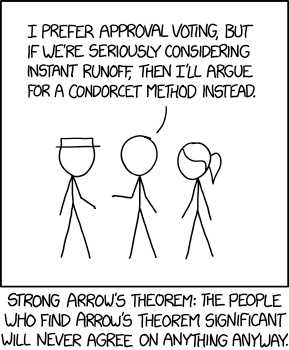

<style>
.dem { text-decoration: underline 2px #727ecf; }
.rep { text-decoration: underline 2px #e93834; }
.ind { text-decoration: underline 2px #d67c00; }
.prg { text-decoration: underline 2px #c55faf; }
.grn { text-decoration: underline 2px #76a254; }
.wtn { text-decoration: underline 2px #666666; }
</style>
::: {.epigraph}
The sciences have likewise taught us to ascertain the several degrees of
certainty to which we may hope to attain; \[...\] what are the
advantages or disadvantages of various forms of election, and modes of
decision dependant on the plurality of voices; the different degrees of
probability which may result from such proceedings \[...\]. ---Marquis
de Condorcet
:::

::: {.epigraph}
I consider it completely unimportant who in the party will vote, or how;
but what is extraordinarily important is this---who will count the
votes, and how. ---Joseph Stalin
:::

With instant-runoff voting [on the
ballot](https://www.bostonglobe.com/2020/07/22/metro/should-person-with-most-number-one-votes-always-win/)
in Massachusetts this year, I've been reading about the math behind
voting systems. As a [theoretical
problem](https://plato.stanford.edu/entries/voting-methods/), the
literature is rife with fascinating results and paradoxes. More
pertinent, though, is what effect this measure would have on the actual
political process in Massachusetts. It would be a significant change to
the electoral process, so it's worth using data to weigh the pros and
cons. I don't presume to tell anyone how to vote on 2; only to collect
some of my own thoughts on the matter.

Instant runoff, like all voting systems, is sometimes derided as
electing the "wrong" candidate based on the voters' expressed
preferences. It's important to remember that, in the absence of either
perfect unanimity, there is no single correct way to generalize a set of
individual preferences into a group preference; different voting methods
simply represent approximations to this, and, though some are better
than others,
[none](https://en.wikipedia.org/wiki/Arrow%27s_impossibility_theorem)
[is](https://en.wikipedia.org/wiki/Gibbard%E2%80%93Satterthwaite_theorem)
[perfect](https://en.wikipedia.org/wiki/Comparison_of_electoral_systems#Compliance_of_selected_single-winner_methods).

# Instant Runoff Voting

Broadly speaking, there are two kinds of voting system. In **ordinal**
systems, voters express relative preferences, usually by ranking
candidates. Ordinal methods include [instant runoff
voting](https://en.wikipedia.org/wiki/Instant-runoff_voting), [Borda
count](https://en.wikipedia.org/wiki/Borda_count), and the various
[Condorcet methods](https://en.wikipedia.org/wiki/Condorcet_method). The
most common system, and perhaps the simplest, [plurality
voting](https://en.wikipedia.org/wiki/Plurality_voting),[^1] is a kind
of degenerate ordinal system that only looks at (and thus only asks)
voters' first choices. In **cardinal** systems, voters express absolute
preferences, giving each individual candidate a numeric score in the
case of [range voting](https://en.wikipedia.org/wiki/Score_voting), or a
binary yes or no in the case of [approval
voting](https://en.wikipedia.org/wiki/Approval_voting).

Instant runoff (hereafter IRV) was developed in the 1870s by William
Ware, an architect who also designed Harvard's beautiful Gothic-revival
[Memorial
Hall](https://sites.fas.harvard.edu/~memhall/img/building.jpg). The
usual explanation goes like this:[^2] voters rank candidates from their
first choice to their last. If a candidate gets a majority (more than
50%) of first-choice votes, that candidate wins. Otherwise, the
candidate with the fewest first-choice votes is eliminated, and ballots
for that candidate *run off* to those voters' next-choice candidates.
Then the ballots are tallied again, and the process repeats, with
last-place candidates eliminated, until one candidate has a majority.

There's an equivalent[^3] formulation that may help to illustrate
things. Imagine you're running a traditional election, in which each
person casts a single vote, but in which the winner must get a majority.
If this doesn't happen, there is a second election: you throw away
ballots of the voters who voted for the least popular candidate, call
those voters back, and force them to vote for one of the remaining
candidates. You recount all the ballots and see if anyone has more than
50%. If not, you remove the last-place candidate from the ballots, call
back all voters, and have them vote *again*. Repeat until there is a
winner (or, heaven forfend, a tie). Of course, asking voters for their
fully ranked choices at once means you don't have to have multiple
successive elections---that's why instant runoff is *instant*.[^4]

Much support for IRV comes from dedicated advocacy nonprofits such as
[FairVote](https://www.fairvote.org/), and from third parties vying for
a fighting chance at the polls. Opposition often comes from the
Democratic and Republican Parties, which allows supporters to paint IRV
as a grassroots, anti-system movement. These groups have put forward
various arguments for and against IRV.

## Pros

### Nuanced positions

The clearest benefit of IRV---and most systems besides plurality---is
allowing voters to express nuanced positions, rather than forcing them
to throw all their weight behind a single candidate. Given this
information, though, it is less clear how to sensibly cohere it into a
single choice; hence the existence of multiple competing voting systems.

### Immunity to vote-splitting

The best-advertised benefit of IRV is that it prevents minor third-party
candidates from
"[spoiling](https://en.wikipedia.org/wiki/Vote_splitting#Spoiler_effect)"
the vote for their ideological peers---the famous examples are (for
liberals) Nader taking votes from Gore in 2000, and (for conservatives)
Perot taking votes from Bush in 1992. By way of example, @fig:fake1
shows the results of an election between the Purple Party and the Yellow
party.

{#fig:fake1}

Two candidates, B and C, ran under the Yellow platform, splitting the
vote. In a plurality election, the Purple candidate A would win. Under
IRV, though, Purple has failed to attain a majority, so there is a
second round (@fig:fake2).

{#fig:fake2}

The votes of the least popular candidate, C, are reallocated to B, those
voters' second choice, and B wins with a majority.

Of course, in national elections, third parties rarely manage numbers
like C did, because would-be C voters vote
[tactically](https://en.wikipedia.org/wiki/Tactical_voting) (i.e.,
against their preferences) for B to avoid an A victory. I don't know how
many major-party voters would truly have preferred a third-party
candidate, but while [more than
half](https://news.gallup.com/poll/244094/majority-say-third-party-needed.aspx)
of Americans think that the two major parties "do such a poor job that a
third major party is needed", fewer than [ten
percent](https://fivethirtyeight.com/features/america-isnt-really-set-up-for-third-party-presidential-bids/)
of voters typically vote third-party. This is pretty damning for
plurality, but not the whole story; as we will see, there are other
kinds of spoilage under IRV.

### Guaranteed majority winner

Proponents of IRV often point to the majority criterion as evidence that
IRV elects a "majority winner". This is technically true, but a bit
misleading, since the round in which the voters express a majority
opinion may contain only a small subset of the original candidates.

### More positive campaigning

Proponents of IRV often claim that it reduces negative campaigning,
since candidates must expand their campaigns to try to capture
second-choice votes from outside their bases. The claim, *prima facie*,
seems pretty fishy---after all, candidates are still jockeying for a
single seat, and even in Cambridge, where the nine city councillors are
chosen by a variant of IRV, candidates ask for a [\#1
vote](https://centersandsquares.com/wp-content/uploads/2013/10/Cambridge-Election-Signs.jpg)---never
for \#2. However, @donovan2016campaign surveyed six cities by phone in
2013, and found that voters in the three cities using IRV perceived less
negativity and criticism in political campaigning than in the control
cities. Of course, this doesn't prove causation: the authors themselves
note that "it may be that cities with a more civil and less adversarial
political context were somehow more likely to adopt preferential
voting." [@donovan2016campaign,p. 162] It would be most interesting to
see voters' perceptions within a city before and after IRV is enacted.
Nonetheless, this is encouraging for voters who are tired of jejune
smear campaigns.

## Cons

### Complexity and cost

A common bugbear is that IRV is too complex in some way---this will turn
out to be overblown. A related, and serious, concern is the need to
replace perfectly good voting machines at significant cost to the
taxpayer. Even educating voters could be expensive: mailing
informational pamphlets to [2.6 million
households](https://www.census.gov/quickfacts/MA) at a [19¢ bulk
rate](https://www.themailshark.com/resources/blog/bulk-mail-postage-rates/)
would cost nearly half a million dollars.

Of course, complaints about implementing the algorithm itself are
patently unfounded---it can be done in just a few lines of code, and has
linear time complexity in both the number of voters and the number of
candidates.

``` {.haskell}
import Data.List

data Candidate = Kiss | Montroll | Simpson | Smith | Wright deriving (Show, Eq)
type Ballot = [Candidate]

irv :: [Candidate] -> [Ballot] -> Candidate
irv candidates ballots
    | any (> 0.5) shares = last rankings -- If we have a majority, return the winner
    | otherwise = irv candidates' ballots' -- Otherwise, rerun with new parameters
      where
        -- Get vote share of each remaining candidate
        shares = map (\c -> (genericLength . filter (== c) $ map head ballots) /
                            (genericLength ballots)) candidates

        -- Rank candidates in (ascending) order of share
        rankings = map fst . sortOn snd $ zip candidates shares

        -- Remove eliminated candidates and exhausted ballots 
        candidates' = candidates \\ [head rankings]
        ballots' = filter (not . null) $ map (dropWhile (`notElem` candidates')) ballots
```

### Unequal representation

Another complaint about IRV is that it doesn't treat all votes equally.
Kathy Dopp
[writes](http://electionmathematics.org/ucvAnalysis/US/RCV-IRV/InstantRunoffVotingFlaws.pdf#page=10)
that:

> Some voters' second choices are considered in a timely fashion when
> their second choice candidates are still in the contest. Less lucky
> voters' \[sic\] have their second choices considered only after it is
> too late to help that candidate to win. Some of the most unlucky
> voters only have their first choice considered, even though their
> first choice candidate loses.

and an [anti-IRV
op-ed](https://www.bostonglobe.com/2020/09/20/opinion/why-ranked-choice-is-wrong-choice/)
in the *Globe* posits that:

> \[IRV\] thus gives some voters multiple bites of the election apple.
> At the same time, it effectively disenfranchises other voters---those
> who don't rank enough candidates for their ballot to last through
> multiple rounds of tabulation.

This seems to rest on a very strange notion of what it means for two
ballots to be equal. The usual, and I think correct, rejoinder is that
some voters have their first choice considered *multiple times*, while
for others consideration runs down their ballot as their favorites are
successively struck off. A ballot expressing *n* preferences is
guaranteed to be counted in the first *n* rounds, and one expressing all
preferences will always be in contention. It is the same as there being
*n* consecutive elections with fewer and fewer options. Since in reality
these "elections" take place at the same time, it costs voters nothing
to fill in one extra bubble; if they don't, presumably they simply don't
care.

### Non-additivity

In an IRV election, every ballot needs to be tallied to know whether a
runoff is necessary. This means that there is no meaningful notion of a
subtotal in IRV. Unlike in a plurality election, the collection of
ballots from a certain district don't add to anything, so one can't
really say who the district "voted for". This is mostly a
curiosity---its only real effect is precluding early reporting, which at
any rate is [notoriously
unreliable](https://www.nytimes.com/2016/09/11/us/politics/election-results-voting.html)
and possibly even detrimental, having significant effects on voter
turnout [@jackson1983election].

### Paradoxical results

Much more serious are IRV's violations of expected behavior. IRV can
lead to some [very strange behavior](http://zesty.ca/voting/sim/), an in
particular to violations of
[monotonicity](https://en.wikipedia.org/wiki/Monotonicity_criterion), by
which tactical voting by organized blocs is made possible. To see how,
let's look at the strange case of Burlington.

# Burlington, 2009

The [2009 mayoral
election](https://en.wikipedia.org/wiki/2009_Burlington_mayoral_election)
in Burlington, Vermont unintentionally became a case study in the
efficacy of IRV---and a parable for anti-IRV crusaders after the
controversial results led the system to be scrapped the following year.

## Meta concerns

Some commentators were concerned about the complexity of IRV---voters
would either fail to understand the new system, or simply be unwilling
to express preferences. The latter concern was not borne out; most
voters expressed preferences, with interest predictably dropping off by
an average of 25% with each successive choice after the first
(@fig:choices).

{#fig:choices}

Furthermore, the introduction of IRV in 2005 did not depress turnout; as
@fig:turnout shows, it increased even as the population stagnated.

{#fig:turnout}

Some also expressed concern that introducing ranked choices would render
ballots dauntingly complex for some voters. The complexity of a ballot,
though, depends much more on the way it presents options than on the
options themselves. A well-designed ballot works with voters; a
poorly-designed ballot stymies them.

A Florida ballot from the 2000 presidential election in Florida is shown
in @fig:florida. While Palm Beach's infamous ["butterfly
ballots"](https://commons.wikimedia.org/wiki/File:Butterfly_Ballot,_Florida_2000_(large).jpg)
dominated the news cycles, these ballots from Duval County are arguably
worse---the *New York Times*
[reported](https://www.nytimes.com/images/2001/11/12/politics/recount/results/design-v4.html)
that the two-column layout made voters were *twelve* times as likely as
other counties to accidentally vote for two candidates.

)](images/7915e51f424a9a8a4bdaf1bf6014907b13924269.gif){#fig:florida
width="400px"}

Other factors besides the columnar layout contribute to the poor design.
The incredible preponderance of horizontal lines makes it impossible to
divide the ballot into logical sections. They separate the presidential
candidates from each other---though not the others---and offset the
highest-level titles ("Congressional") above and below. In addition, the
party labels for the presidential candidates are the same size and style
as the smaller titles ("United States Senator"). It is easy to see how a
voter could mistake the presidential candidates in the middle column for
those in another race entirely.

By way of contrast, a ballot from the Burlington election is shown in
@fig:vermont.

{#fig:vermont
width="400px"}

This ballot admittedly has fewer races to collate, but still has to
collect rank information. It does so elegantly with a tabular display,
like what Tufte calls a [*small
multiple*](https://en.wikipedia.org/wiki/Small_multiple)
[@tufte1990envisioning,p. 29]:

> An economy of perception results; once viewers decode and comprehend
> the design for one slice of data, they have familiar access to data in
> all the other slices. As our eye moves from one image to the next,
> this constancy of design allows viewers to focus on changes in
> information rather than changes in graphical composition. A steady
> canvas makes for a clearer picture.

Indeed, unlike Duval County, which saw fully [nine
percent](https://www.salon.com/2000/11/13/duval/) of its ballots
invalidated in 2000, Burlington saw only four ballots incorrectly filled
out---less than a twentieth of a percent. Exit polls from the 2006
election further showed that only
[8.6%](https://www.uvm.edu/~vlrs/IRV.pdf#page=12) of voters found the
ballot confusing.

Thus, concerns that IRV was too complicated seem to have been
unfounded---though not entirely unfair. Voting systems can be
arbitrarily complex, particularly ones that elect multiple winners, and
it would not be reasonable feed citizens' votes into what may as well be
a black-box algorithm and expect them to placidly accept the results.
Whatever the merits of a voting system, it should also be simple enough
for a typical eighteen-year-old to understand, and IRV seems to fit this
bill.

## Instant runoff results

After a successfully executed election, the votes were tallied.[^5] The
candidates were [Bob Kiss]{.prg} (Progressive, incumbent), [Andy
Montroll]{.dem} (Democrat), [James Simpson]{.grn} (Green). [Dan
Smith]{.ind} (Independent), and [Kurt Wright]{.rep} (Republican). Had
this been an ordinary plurality election, only voters' first choices
(@fig:round1) would have been considered. The winner, with less than a
third of the votes, would be the conservative [Wright]{.rep}, with the
liberal vote [split](https://en.wikipedia.org/wiki/Vote_splitting)
between [Montroll]{.dem} and [Kiss]{.prg}. In a two-round system, as
used by France, [Kiss]{.prg} and [Wright]{.rep} would have appeared on a
second ballot, and---assuming the same relative preferences as the first
time---[Kiss]{.prg} would have won by four points.

{#fig:round1}

Of course, IRV requires a majority, which, even after eliminating
[Simpson]{.grn} and the write-ins, we clearly do not yet have. The
next-least-popular candidate is [Smith]{.ind}---his votes go more or
less evenly to the remaining three.

{#fig:round2}

Still no majority. Next to go is [Montroll]{.dem}. His votes, and the
votes of the [Smith]{.ind} voters reallocated to him, are reallocated in
round 3.

{#fig:round3}

With most of the votes going to [Kiss]{.prg}, he ekes out a majority.
(Since some ballots didn't specify higher choices, the percentages are
of the ballots remaining after each runoff.)

The problem with this result is that [Montroll]{.dem} was *individually*
more popular than any of the other candidates. How, then, did he fail to
be elected? Basically, voters could be divided into liberal and
conservative blocs, with liberals favoring [Montroll]{.dem} or
[Kiss]{.prg}, and conservatives favoring [Wright]{.rep}, but preferring
the more moderate [Montroll]{.dem} over the far-left [Kiss]{.prg}. But
since [Wright]{.rep} was a contender to the last, the lower rankings of
his supporters were never accounted for. This can be more easily seen by
simulating the results of other voting systems.

## Borda count results

In a Borda count, all of a candidate's votes are weighted and added; so
each first-choice vote gives a candidate 5 points, second-choice votes
4, and so on. For instance, [Kiss]{.prg}' Borda score would be
$(2,586 \times 5) + (1,404 \times 4) + (962 \times 3) + (741 \times 2) + (491 \times 1) = 23,405$.
This method gives much more weight to lower-ranked candidates than other
methods, and is therefore highly amenable to centrist candidates with
broad, if tepid, appeal.

{#fig:borda}

[Wright]{.rep} and [Kiss]{.prg} were popular first-choice votes, but
didn't garner many next-choice votes, while [Montroll]{.dem} and
[Smith]{.ind} emerged as compromise candidates, with many more second-
and third-choice votes than first-choice (the former would indeed have
been the Borda winner). [Simpson]{.grn} proved very unpopular, with
mostly last-place votes.

## Condorcet results

Condorcet voting methods pit each candidate against the others
round-robin style; if one always prevails, that candidate wins. The
[Condorcet criterion](https://en.wikipedia.org/wiki/Condorcet_criterion)
of always electing the pairwise winner, if there is one, is sometimes
imposed on other methods. Of course, there is not always such a winner,
as in rock paper scissors. However, the Burlington race did have such a
winner---[Montroll]{.dem}---and IRV was much maligned after the fact for
eliminating him in the second round.

{#fig:cond}

## Summary & lessons

The results of different methods are summarized in @tbl:summary.

  Method          Choice 1           Choice 2         Choice 3           Choice 4         Choice 5
  --------------- ------------------ ---------------- ------------------ ---------------- -----------------
  Plurality       [Wright]{.rep}     [Kiss]{.prg}     [Montroll]{.dem}   [Smith]{.ind}    [Simpson]{.grn}
  Two-round       [Kiss]{.prg}       [Wright]{.rep}   [N/A]{.grayed}     [N/A]{.grayed}   [N/A]{.grayed}
  IRV             [Kiss]{.prg}       [Wright]{.rep}   [Montroll]{.dem}   [Smith]{.ind}    [Simpson]{.grn}
  Borda Count     [Montroll]{.dem}   [Kiss]{.prg}     [Wright]{.rep}     [Smith]{.ind}    [Simpson]{.grn}
  Condorcet[^6]   [Montroll]{.dem}   [Kiss]{.prg}     [Wright]{.rep}     [Smith]{.ind}    [Simpson]{.grn}

  : Full rankings produced by various methods, excluding write-ins
  {\#tbl:summary}

Since [Montroll]{.dem} would have beat any other candidate head-to-head,
he would have been the winner if he had made it to the final round. Of
course, this would have happened if more people had ranked him first.
But, incredibly, it could also have happened if a contingent of
[Wright]{.rep} voters had simply [stayed
home](https://en.wikipedia.org/wiki/Participation_criterion). Let's say
that a random third of [Wright]{.rep} voters had stayed home on election
day.

{#fig:nowright-round1}

[Wright]{.rep} now starts out third in the rankings
(@fig:nowright-round1), and is still last after [Smith]{.ind} is
eliminated (@fig:nowright-round2).

{#fig:nowright-round2}

Now [Wright]{.rep} is eliminated, and the bulk of his votes go to
[Montroll]{.dem}, carrying the latter to a four-point victory.

{#fig:nowright-round3}

This may seem like an esoteric or academic concern (headline: "If Public
Had Voted Differently, A Different Candidate Would Have Won"), but its
threat is twofold. One is that it makes tactical voting possible. It's
hard to win the match; it's easier to bet against yourself and take a
fall. Of course, tactical voting occurs under plurality voting as well:
namely, Nader supporters bubbling in Gore to hurt Bush. By not
expressing their true preferences, they throw the match for their
first-choice candidate in order to help their more popular second
choice. The concern here is of the same kind---that a bloc of
[Wright]{.rep} supporters could scuttle their own candidate to get a
second-favorite in.[^7]

The second problem is that the results now border on
incongruous---surely whether [Kiss]{.prg} or [Montroll]{.dem} wins
should not depend on the number of [*Wright*]{.rep} voters who turn out.
This is a violation of the rule of [independence of irrelevant
alternatives](https://en.wikipedia.org/wiki/Independence_of_irrelevant_alternatives).
(A similar result, of course, would have happened if these
[Wright]{.rep} voters had still voted, but ranked [Montroll]{.dem}
first.) This, in a sense, makes [Wright]{.rep} the "spoiler" in this
election. It actually gets weirder; it is [theoretically
possible](https://www.rangevoting.org/Burlington.html) for just the
right subset of [Wright]{.rep} voters to hurt [Kiss]{.prg} *by voting
for him instead of [Wright]{.rep}*.

{#fig:flip-round1}

[Kiss]{.prg} now has a very strong out-of-the-gate lead, with
[Wright]{.rep} barely ahead of [Montroll]{.dem}.

{#fig:flip-round2}

With [Smith]{.ind}'s votes reallocated, [Wright]{.rep} is eliminated,
and now all of his votes go to [Montroll]{.dem}.

{#fig:flip-round3}

This illustrates how IRV violates the principle of
[monotonicity](https://en.wikipedia.org/wiki/Monotonicity_criterion),
which says that you shouldn't be able to hurt a candidate by giving them
more votes, or help them by taking away votes.[^8] @riker1982liberalism
[p. 51] writes that:

> If we assume that the purpose of voting is to amalgamate individual
> tastes into a social decision, then monotonicity requires that voting
> actually do so by counting all individual judgments in generating an
> outcome. Moral (as distinct from technical) considerations may arise
> in choosing between forms of monotonicity. For example, one might
> prefer a two-thirds majority (monotonic) to a simple majority
> (strongly monotonic) on ethical grounds. But that some kind of
> monotonicity be required is hardly a moral question. It is simply a
> straightforward matter of making the voting system do what it is
> supposed to do.

Tactical voting, if prevalent enough, could neutralize the boost IRV is
supposed to provide to third parties---notice that if [Kiss]{.prg}
voters were concerned about *his* viability hurting [Montroll]{.dem} and
putting [Wright]{.rep} in office, they might have bailed on [Kiss]{.prg}
in the same way. The odds of this happening are pretty slim, as it more
or less requires knowing the results in advance (if [Wright]{.rep} had
any kind of fighting chance, it's unlikely his voters would have thrown
the vote by staying home). But the odds of getting an monotonicity
violation, as Burlington did, may be significant enough to worry about.

# Probability of paradoxical results

Of course, no voting system is perfect; all fall prey to unexpected
results given the right input parameters. Much of the literature looks
at the probability of not having a Condorcet winner at all; e.g., Riker
[@riker1982liberalism,p. 122] puts it at about 25% for 5 candidates,
assuming people vote [basically at
random](https://en.wikipedia.org/wiki/Impartial_culture). This is of
lower import, though, because neither plurality nor IRV may deal with
this kind of paradox sensibly---and under plurality, no one would ever
even know it happened. More serious is the probability of
nonmonotonicity---of seeing a repeat of Burlington in Massachusetts.
This can be done theoretically, with Monte Carlo simulations, or
empirically, by looking at datasets of past elections.

@ornstein2014frequency run simulations of three-candidate elections to
find the probability of a monotonicity failure, by which giving more
votes to the top-ranked candidate A might end up electing candidate C.
For this to happen, C must receive more than one fourth of the total
votes, and be the Condorcet winner, if there is one. A simplified
version of the Burlington election satisfies these requirements, as
@tbl:rank shows. Here, A is [Kiss]{.prg}, B is [Wright]{.rep}, and C is
[Montroll]{.dem}.

  Relative ranking                                     Ballots
  ---------------------------------------------------- ---------
  [Kiss]{.prg} \> [Montroll]{.dem} \> [Wright]{.rep}   2,043
  [Kiss]{.prg} \> [Wright]{.rep} \> [Montroll]{.dem}   371
  [Wright]{.rep} \> [Kiss]{.prg} \> [Montroll]{.dem}   496
  [Wright]{.rep} \> [Montroll]{.dem} \> [Kiss]{.prg}   1,513
  [Montroll]{.dem} \> [Kiss]{.prg} \> [Wright]{.rep}   1,332
  [Montroll]{.dem} \> [Wright]{.rep} \> [Kiss]{.prg}   767

  : Relative rankings of the three top candidates, from the ballots that
  ranked at least two. Montroll emerged as a compromise over the more
  polarizing Kiss and Wright. {\#tbl:rank}

They find that roughly 15--20% of elections exhibit this behavior, with
the number reaching 50% for elections in which two of the three
candidates are ideologically very close. @miller2017closeness calculates
similar numbers---around 50% for certain assumptions about voter
distribution, and the election being competitive.

What, then, is the probability of an election being "competitive"?
Miller [-@miller2017closeness] analyzes U.K. Parliamentary races with
only three parties, finding that only 5% could be considered
competitive. This is encouraging, but Parliamentary elections use
plurality voting; IRV may well lead to an increase in competitiveness as
third parties vie more strongly. FairVote, a pro-IRV nonprofit,
[claims](https://www.fairvote.org/data_on_rcv) that "\[o\]f the 322
single-winner RCV elections in the United States since 2004 in which we
have sufficient ballot data \[...\], 321 elections were won by the
Condorcet winner", although they don't make their data public (the
exception, of course, was Burlington). They also claim that:

> There have been 204 single-winner ranked choice elections in the U.S.
> which included at least 3 candidates. In 96 of these (or 47%), a
> majority winner was identified in the first round. The remaining 108
> races went into the instant runoff before declaring a winner.

They count 381 races total, so half had more than two candidates, and
half again had no first-round majority. Miller [-@miller2017closeness]
claims that 60% of the 2,642 Parliamentary elections analyzed had a
majority winner. This is significantly different from FairVote's numbers
($\chi^2 = 12.588$, $p < 0.001$),[^9] but it's unclear that IRV was the
cause.

As an educated guess, we can estimate that 10--20% of IRV elections will
be "competitive", and that half of those, or 5--10%, will display a
monotonicity failure.

# Propensity to a two-party system

A well-known critique of plurality voting, known as [Duverger's
law](https://en.wikipedia.org/wiki/Duverger%27s_law), is that it tends
toward a two-party system over time. The reasoning, of course, is that
voters shy away from voting third-party for fear of splitting the vote.
The United States, which has always used plurality voting nationally,
has largely hewn to this law, with each [party
system](https://en.wikipedia.org/wiki/Party_system#United_States)
shakeup quickly stabilizing to two dominant parties. However, some
contend that due to paradoxical results like Burlington, IRV has the
same tendency over a long enough period.

We can get a sense of whether this is true by looking at countries that
use IRV nationally. For example, the Australian House of
Representatives, the lower of its houses of parliament, has used IRV
since 1918.[^10] If we look at
[results](https://australianpolitics.com/elections/house-results/house-election-results-since-1972)
of House elections for the past half-century, we see that while politics
is largely dominated by the left-leaning Labor Party and right-leaning
Liberal and National Parties, a small number of seats have gone to
Greens and independent candidates.

\
<svg width="8" height="8"><circle cx="4" cy="4" r="4" fill="#727ecf" stroke="none" /></svg> [Liberal](https://en.wikipedia.org/wiki/Liberal_Party_of_Australia)\
<svg width="8" height="8"><circle cx="4" cy="4" r="4" fill="#b9bfe7" stroke="none" /></svg> [Liberal
National](https://en.wikipedia.org/wiki/Liberal_National_Party_of_Queensland)\
<svg width="8" height="8"><circle cx="4" cy="4" r="4" fill="#e6ab02" stroke="none" /></svg> [National](https://en.wikipedia.org/wiki/National_Party_of_Australia)\
<svg width="8" height="8"><circle cx="4" cy="4" r="4" fill="#d67c00" stroke="none" /></svg> [Country
Liberal](https://en.wikipedia.org/wiki/Country_Liberal_Party)\
<svg width="8" height="8"><circle cx="4" cy="4" r="4" fill="#76a254" stroke="none" /></svg> [Greens](https://en.wikipedia.org/wiki/Australian_Greens)\
<svg width="8" height="8"><circle cx="4" cy="4" r="4" fill="#888888" stroke="none" /></svg> Independent/other](images/fbd5d046964ec008eee33763f4e3dd0ffd1cc129.svg){#fig:aus-house}

It's important to note that @fig:aus-house presents statistical
averages. Each bar represents the results of a 150 or so *individual*
elections, each of which might have seen different local factions
competing on different issues. Nevertheless, compare this with the party
allocations in the U.S. House during the same period:

{#fig:us-house}

There are only a
[handful](https://en.wikipedia.org/wiki/Third-party_and_independent_members_of_the_United_States_House_of_Representatives#1949%E2%80%93present:_Modern_era)
of independents, most of whom are closely affiliated with one party or
another, and only one third-party candidate: Libertarian Justin Amash,
MI-3, who was elected as a Republican. So the U.S., possibly because as
a side effect of plurality voting, is particularly inimical to
third-party representation. We don't see this effect in [Commons
elections](https://commonslibrary.parliament.uk/research-briefings/cbp-8647/)
in the U.K., however, which also use plurality voting, but afford
relatively rich third-party representation (note that the pink and gray
bands in @fig:uk-house represent multiple parties).

![Party allocations from U.K. House of Commons elections since 1970\
\
<svg width="8" height="8"><circle cx="4" cy="4" r="4" fill="#e93834" stroke="none" /></svg> Labour\
<svg width="8" height="8"><circle cx="4" cy="4" r="4" fill="#727ecf" stroke="none" /></svg> Conservative\
<svg width="8" height="8"><circle cx="4" cy="4" r="4" fill="#e6ab02" stroke="none" /></svg> Liberal
Democrats\
<svg width="8" height="8"><circle cx="4" cy="4" r="4" fill="#c55faf" stroke="none" /></svg> Scottish
& Welsh national parties\
<svg width="8" height="8"><circle cx="4" cy="4" r="4" fill="#888888" stroke="none" /></svg> Independent/other](images/d64137827ca3c3e23cbbdda4e0d1ae8ca2727c01.svg){#fig:uk-house}

This may be an effect of the parliamentary system, which allows
coalitions, reducing competition between ideologically similar parties.
It may also be an effect of smaller constituencies---about 100,000
people per district in the U.K., versus 750,000 in the U.S.---making it
easier for smaller parties to secure local support. The final salient
difference is that U.S. House elections are much less consequential than
Commons or Australian House elections, because they are more frequent
(compare the sizes of the graphs), and because since
[1913](https://www.law.cornell.edu/constitution-conan/amendment-17) the
U.S. has also directly elected senators, though it's unclear why this
would make a difference. Possibly, the two-party system is simply too
deeply set in U.S. culture to be meaningfully pried away.

# Conclusion

The pros of adopting IRV seem to be:

-   Relative simplicity, assuming the ballots are designed properly
-   Allowing voters to express nuanced opinions
-   Elimination of spoilage by small parties
-   Probable reduction in tactical voting, and the slim possibility of
    third parties becoming serious contenders
-   Possible reduction in negative campaigning

and the cons are:

-   A possibly nontrivial one-time cost of converting voting machines
    and educating voters
-   Small (5--10%) chance of spoilage with three or more large parties
-   The very remote possibility of tactical voting by voting blocs on
    the extremes of the political spectrum

It's important in all this to avoid two traps. One is the
[Lucas](https://en.wikipedia.org/wiki/Lucas_critique) trap: you can't
theorize about the outcome of an election using past data from a
*different* voting system. Both voters and political parties will change
their strategies if the system changes. Burlington voters would not
likely have voted the same way in 2009 if the decision was to have been
by simple plurality.[^11]

The second trap, of course, is of caring more about voting systems than
their results. There are many more voting systems out there, many of
them [combining](https://www.daneckam.com/?p=374) the methods above, and
a whole [branch of
economics](https://plato.stanford.edu/entries/social-choice/) that
studies them. It's easy to get stuck in the mire of voting system
wonkery, but only IRV is on the ballot this year, so ultimately it
doesn't matter whether it is better than proportional Bayesian
transferable semi-ranked-score-minimax; only whether it's better than
plurality.[^12] Anthony Gottlieb in the *New Yorker* [points
out](https://www.newyorker.com/magazine/2010/07/26/win-or-lose) that:

> Mathematics can suggest what approaches are worth trying, but it can't
> reveal what will suit a particular place, and best deliver what we
> want from a democratic voting system: to create a government that
> feels legitimate to people---to reconcile people to being governed,
> and give them reason to feel that, win or lose (especially lose), the
> game is fair.

Incidentally, after a decade of dormancy, IRV is [back on the
ballot](https://vtdigger.org/2020/07/14/burlington-council-puts-ranked-choice-voting-on-november-ballot-%EF%BB%BF/)
in Burlington. It will be interesting to see if the public warms to it
again.

[^1]: Sometimes given the hokey name "first past the post". Note that a
    **plurality** is not the same as a **majority**: a majority requires
    more than 50% of votes, while a plurality just requires more votes
    than anyone else.

[^2]: See, e.g., [PBS](https://www.youtube.com/watch?v=HoAnYQZrNrQ) or
    [C.G.P.
    Grey](http://www.cgpgrey.com/politics-in-the-animal-kingdom/).

[^3]: Assuming voters' preferences are stable across time.

[^4]: In a [two-round
    system](https://en.wikipedia.org/wiki/Two-round_system), the second
    election really does take place, but with all but two candidates
    removed, to guarantee there will be a majority.

[^5]: [Full ballot
    data](https://web.archive.org/web/20110725111632/http://www.burlingtonvotes.org/20090303/2009%20Mayor%20Reports.zip)
    (ZIP, 72 KiB)

[^6]: [Copeland's
    method](https://en.wikipedia.org/wiki/Copeland%27s_method)

[^7]: See [this video](https://www.youtube.com/embed/JtKAScORevQ) for
    another illustration.

[^8]: The former case is known as an *upward monotonicity violation*,
    and the latter a *downward monotonicity violation*.

[^9]: ``` {.r}
    chisq.test(
        matrix(c(2642*0.6,
                 2642*0.4,
                 96,
                 204-96),
            nrow=2))
    ```

[^10]: Ireland also uses runoff voting to elect its lower house, [Dáil
    Éireann](https://en.wikipedia.org/wiki/D%C3%A1il_%C3%89ireann), to
    elect its lower house, but it is more complicated as most district
    races have multiple winners.

[^11]: Indeed, in the [2012
    race](https://www.burlingtonvt.gov/sites/default/files/CT/ElectionResults/20120306/election_summary_report_20120306.pdf),
    after IRV was repealed, only three candidates ran, with the
    independent barely mustering 5%.

[^12]: (Source: [xkcd](https://xkcd.com/1844/))

    
