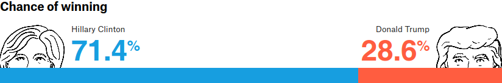

<style>
.c, .t { color: #ffffff; padding: 0.5pt 2pt; border-radius: 3pt; font-size: 12px; font-family: Libertinus Mono; font-weight: bold; }
.c { background: #727ecf; }
.t { background: #e93834; }
</style>
::: {.epigraph}
Oh! let us never, never doubt\
What nobody is sure about!
:::

The 2016 presidential election was an ignominious moment for pollsters,
who overwhelmingly favored Clinton to the last, even as exit poll data
belied their forecasts. Even *Five­Thirty­Eight*, one of the
[most](https://fivethirtyeight.com/features/trump-is-just-a-normal-polling-error-behind-clinton/)
[generous](https://fivethirtyeight.com/features/election-update-dont-ignore-the-polls-clinton-leads-but-its-a-close-race/)
toward Trump's chances, gave him only 5 to 2 odds against.



Of course, probabilities are [not](https://xkcd.com/2370/) certainties.
If I assure you that a die has only a 17% chance of coming up 6 (which,
if it's fair, it does), you can't call me a liar if you roll it once and
get a 6. A presidential election is a massive, complex die roll that,
for political reasons, can't be repeated 10,000 times to generate a
sampling distribution. In this light, it's impossible to say whether
*Five­Thirty­Eight*'s probabilities were accurate or not---you would
have to run the election many times in parallel universes, and see
whether Trump was victorious in two out of every seven of them.

We can get some sense, though, by looking at the state-level
predictions. This gives us 56 data points (50 states, Washington D.C.,
and the five independently awarded districts of [Maine and
Nebraska](https://www.270towin.com/content/split-electoral-votes-maine-and-nebraska/)),
which we can treat, roughly, as 56 separate races. In general, if the
pollsters are accurate, Clinton should win about 20% of the races which
they gave her a 20% chance of winning. It may seem like Trump should
sweep these races---20% is low, after all. But giving a candidate 20%
rather than 0% captures something about your certainty---about how
surprised you'd be if the candidate won. For example,
*Five­Thirty­Eight* gave Clinton 0% in Alabama, but 20% in
Georgia---and, indeed, Georgia saw a much closer race.[^1] Our
intuitions should bear this out: if Clinton had won Georgia, it would be
an upset; if she had won Alabama, it would be a refactoring of American
politics as we know it. By binning together state-level predictions, we
can gauge whether more or less certainty was warranted, and visualize
the results with a *calibration plot* (@fig:538).

\
\
<svg width="20" height="4"><line x1="0" y1="0" x2="20" y2="0" stroke-width="4" stroke="#727ecf" /></svg> Clinton
win\
<svg width="20" height="4"><line x1="0" y1="0" x2="20" y2="0" stroke-width="4" stroke="#e93834" /></svg> Trump
win\
<svg width="20" height="4"><line x1="0" y1="0" x2="20" y2="0" stroke-width="4" stroke="#e6ab02" /></svg> Gold
standard\
](images/b6969e272a983223da2528fb2520b7fe50611157.svg){#fig:538}

A line above the gold standard indicates underconfidence; below it,
overconfidence. The error bars show 95% confidence intervals, which are
fairly large toward the middle given the small sampling of states
predicted to be swing states. Nonetheless, it is clear that Clinton was
given overly favorable odds to win. *Five­Thirty­Eight* computes its
overall probabilities by running election simulations based on weighted
aggregations of third-party polls. If they had just a little less
credence in Clinton, and a little more in Trump, they might have given
Trump much better odds.

Here's the same data in tabular form:

  Clinton probability   Clinton won   States/districts
  --------------------- ------------- ---------------------------------------------------------------------------------------------------------------------------------------------------------------------------------------------------------------------------------------------------------------------------------------------------------------------------------------------------------------------------------------------------------------------------------------------------------------------------------------------------------------------------------------------------------------------------------------------------------------------------------------
  0--19%                0%            [AL]{.t title="Alabama"} [AR]{.t title="Arkansas"} [ID]{.t title="Idaho"} [IN]{.t title="Indiana"} [KS]{.t title="Kansas"} [KY]{.t title="Kentucky"} [LA]{.t title="Louisiana"} [MO]{.t title="Missouri"} [MS]{.t title="Mississippi"} [MT]{.t title="Montana"} [ND]{.t title="North Dakota"} [NE]{.t title="Nebraska"} [NE1]{.t title="Nebraska, first district"} [NE3]{.t title="Nebraska, third district"} [OK]{.t title="Oklahoma"} [SC]{.t title="South Carolina"} [SD]{.t title="South Dakota"} [TN]{.t title="Tennessee"} [TX]{.t title="Texas"} [UT]{.t title="Utah"} [WV]{.t title="West Virginia"} [WY]{.t title="Wyoming"}
  20--39%               0%            [AK]{.t title="Alaska"} [AZ]{.t title="Arizona"} [GA]{.t title="Georgia"} [IA]{.t title="Iowa"} [OH]{.t title="Ohio"}
  40--59%               20%           [FL]{.t title="Florida"} [ME2]{.t title="Maine, second district"} [NC]{.t title="North Carolina"} [NE2]{.t title="Nebraska, second district"} [NV]{.c title="Nevada"}
  60--79%               50%           [CO]{.c title="Colorado"} [MI]{.t title="Michigan"} [NH]{.c title="New Hampshire"} [PA]{.t title="Pennsylvania"}
  80--100%              95%           [CA]{.c title="California"} [CT]{.c title="Connecticut"} [DC]{.c title="District of Columbia"} [DE]{.c title="Delaware"} [HI]{.c title="Hawaii"} [IL]{.c title="Illinois"} [MA]{.c title="Massachusetts"} [MD]{.c title="Maryland"} [ME]{.c title="Maine"} [ME1]{.c title="Maine, first district"} [MN]{.c title="Minnesota"} [NJ]{.c title="New Jersey"} [NM]{.c title="New Mexico"} [NY]{.c title="New York"} [OR]{.c title="Oregon"} [RI]{.c title="Rhode Island"} [VA]{.c title="Virginia"} [VT]{.c title="Vermont"} [WA]{.c title="Washington"} [WI]{.t title="Wisconsin"}

  : Binned *Five­Thirty­Eight* predictions. Hover over an abbreviation
  to see the full state or district name. {\#tbl:538}

States with probabilities below 20% or above 80% were all won by Trump
and Clinton, respectively, except Wisconsin, which Clinton was given an
83.5% chance of winning, but which she ended up losing by a
three-quarter-point margin. This may seem like a glaring blunder, but
remember: these are probabilities. Clinton won 95% of these states,
which is pretty close to the stated uncertainty. It is entirely possible
that if the election were run many times, Clinton would indeed win
Wisconsin 5 out of 6 times. The real trouble comes in the 0--59% range:
for instance, in the five polities in which Clinton was given between a
40 and 59% chance, she won only one of the five---20%. In these areas,
*Five­Thirty­Eight* was underconfident in Trump.

As mentioned above, these probabilities come from polling data. An
idealized version is shown in @fig:normal: given a population of 100,000
voters, in which 55% intend to vote for Clinton, you can take 10 polls
of 25 people and get different results each time.

![Left: results of ten perfectly random polls of a population of 100,000
in which 55% are Clinton voters.[^2] Right: a possible extrapolation of
poll results to a sampling
distribution.](images/5c16af09d1f49c97524c29e0278e3f6d37b09a9e.svg){#fig:normal}

If we kept drawing perfectly random samples from this population, we
[would end up](https://en.wikipedia.org/wiki/Central_limit_theorem) in
the limit with a normal distribution, whose mean was the population
mean. One way to predict the results of the election---itself a poll
like any other---would be to randomly draw them from the area under this
bell curve. This gives Clinton an 84% chance and Trump a 16% chance
(actually a gross overestimate, as the voting population would be much
larger than 25).

Of course, no poll can achieve a perfectly random sample. It might
sample one demographic more heavily than another, fail to target voters
vs. nonvoters, or simply be
[unlucky](https://fivethirtyeight.com/features/heres-proof-some-pollsters-are-putting-a-thumb-on-the-scale/).
For whatever reason, errors will creep in, and may shift the results of
*every* poll one way or the other; per [Nate
Silver](https://fivethirtyeight.com/features/why-fivethirtyeight-gave-trump-a-better-chance-than-almost-anyone-else/):

> \[P\]olling errors are correlated. No matter how many polls you have
> in a state, it's often the case that all or most of them miss in the
> same direction. Furthermore, if the polls miss in one direction in one
> state, they often also miss in the same direction in other states,
> especially if those states are similar demographically.

Technically, then, since these are not independent probabilities,
@fig:538 is technically a little unfair to *Five­Thirty­Eight*.[^3] The
errors inherent in methods of the polls they used compounded on them,
and threw off their probability calculations.

So as not to pick on *Five­Thirty­Eight* too much, let's look at what
the *New York Times* predicted, as a calibration plot:

\
\
<svg width="20" height="4"><line x1="0" y1="0" x2="20" y2="0" stroke-width="4" stroke="#727ecf" /></svg> Clinton
win\
<svg width="20" height="4"><line x1="0" y1="0" x2="20" y2="0" stroke-width="4" stroke="#e93834" /></svg> Trump
win\
<svg width="20" height="4"><line x1="0" y1="0" x2="20" y2="0" stroke-width="4" stroke="#e6ab02" /></svg> Gold
standard\
](images/b5abf744ecd7f42fc8fb94598b73c1fbc00175b6.svg){#fig:nyt}

and as a table:

  Clinton probability   Clinton won   States/districts
  --------------------- ------------- ---------------------------------------------------------------------------------------------------------------------------------------------------------------------------------------------------------------------------------------------------------------------------------------------------------------------------------------------------------------------------------------------------------------------------------------------------------------------------------------------------------------------------------------------------------------------------------------------------------------------------------------------------------------------------------------------------------------------------------------
  0--19%                0%            [AK]{.t title="Alaska"} [AL]{.t title="Alabama"} [AR]{.t title="Arkansas"} [AZ]{.t title="Arizona"} [GA]{.t title="Georgia"} [ID]{.t title="Idaho"} [IN]{.t title="Indiana"} [KS]{.t title="Kansas"} [KY]{.t title="Kentucky"} [LA]{.t title="Louisiana"} [MO]{.t title="Missouri"} [MS]{.t title="Mississippi"} [MT]{.t title="Montana"} [ND]{.t title="North Dakota"} [NE]{.t title="Nebraska"} [NE1]{.t title="Nebraska, first district"} [NE2]{.t title="Nebraska, second district"} [NE3]{.t title="Nebraska, third district"} [OK]{.t title="Oklahoma"} [SC]{.t title="South Carolina"} [SD]{.t title="South Dakota"} [TN]{.t title="Tennessee"} [TX]{.t title="Texas"} [WV]{.t title="West Virginia"} [WY]{.t title="Wyoming"}
  20--39%               0%            [IA]{.t title="Iowa"} [ME2]{.t title="Maine, second district"} [NC]{.t title="North Carolina"} [UT]{.t title="Utah"}
  40--59%               0%            [OH]{.t title="Ohio"}
  60--79%               67%           [FL]{.t title="Florida"} [NH]{.c title="New Hampshire"} [NV]{.c title="Nevada"}
  80--100%              87%           [CA]{.c title="California"} [CO]{.c title="Colorado"} [CT]{.c title="Connecticut"} [DC]{.c title="District of Columbia"} [DE]{.c title="Delaware"} [HI]{.c title="Hawaii"} [IL]{.c title="Illinois"} [MA]{.c title="Massachusetts"} [MD]{.c title="Maryland"} [ME]{.c title="Maine"} [ME1]{.c title="Maine, first district"} [MI]{.t title="Michigan"} [MN]{.c title="Minnesota"} [NJ]{.c title="New Jersey"} [NM]{.c title="New Mexico"} [NY]{.c title="New York"} [OR]{.c title="Oregon"} [PA]{.t title="Pennsylvania"} [RI]{.c title="Rhode Island"} [VA]{.c title="Virginia"} [VT]{.c title="Vermont"} [WA]{.c title="Washington"} [WI]{.t title="Wisconsin"}

  : Binned *New York Times* predictions. Hover over an abbreviation to
  see the full state or district name. {\#tbl:nyt}

We see the same pattern here as with *Five­Thirty­Eight*. The *Times*
was right on the mark in assigning probabilities to Clinton above 60%.
It erred in giving her odds too generous below that mark---Clinton lost
each of the thirty polities in which the *Times* gave her up to a 60%
chance of winning, where realistically, at these levels, she should have
at least snagged a few. The problem was not a failure to predict the
pivots of the historically blue[^4] Michigan and Wisconsin, but a gross
overestimate of Clinton's chances in states like North Carolina and
Utah.

The main thing communicated by probabilities is information about
certainty and uncertainty. If the weather app shows a 10% chance of rain
and it rains anyway, you might be irritated, but whether the app was
*wrong* depends on how often it rains given such a forecast. If it is
more than one in ten times, that's when you might want to change
apps---or start bringing an umbrella.

[^1]: To wit, excluding third parties:
    

[^2]: ``` {.python}
    # Population to sample
    # (0=Trump, 1=Clinton)
    pop = np.random.binomial(
            n=1, p=0.55,
            size=100_000)

    # Draw 10 samples of 25
    polls = [
        np.random.choice(
                pop, size=25,
                replace=False
            ).mean()
        for _ in range(10)
    ]
    ```

[^3]: It also technically double-counts the probabilities in Maine and
    Nebraska, in which the statewide predictions are based on the
    district predictions.

[^4]: Well, since '92
