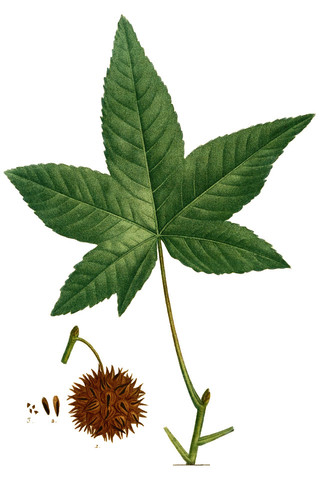

---
addenda:
- '[code](https://github.com/alexklapheke/trees)'
date: 1595378969
title: Cambridge street trees
---

::: {.epigraph}
I think that I shall never see\
A billboard lovely as a tree.\
Indeed, unless the billboards fall\
I'll never see a tree at all.
:::

# Introduction

Every spring, the Callery pear down the street from me displays a
magnificent panoply of white blossoms, and releases... let's say a
*distinct* odor. A few months later, the tree of heaven in my backyard
drops an incredible torrent of flowers onto my porch, and within a few
months, another torrent of seed pods (this tree has it's own smell which
is marginally less unpleasant). It's a subtle difference between a
street lined with, say, honeylocusts and one lined with sycamores, but
trees really do go a long way in defining the character of a place,
making them a crucial consideration in urban planning.

Like many cities, Cambridge has long maintained a [dataset of all
municipal
trees](https://data.cambridgema.gov/Public-Works/Street-Trees/ni4i-5bnn),
including the species, location, date planted, and
[diameter](https://en.wikipedia.org/wiki/Diameter_at_breast_height).[^1]
By exploring this data, we can see what trends and patterns emerge, and
learn something about the arboreal life of our cities.

# Cleaning

Although the dataset does seem to cover every public tree, much of the
data is missing. For example, 83% of trees are missing the date they
were planted, presumably at least in part because they predate the
record system (a few of those that do list dates are from the 1970s).

There are many spurious values as well. Besides misaligned species names
(to be discussed in @sec:var), there are several misspelled genera
(e.g., "Planatus" for <abbr title="sycamore">*Platanus*</abbr>). The
diameter of each tree is listed, but the highest values are 154, 715,
745, 915, and 945 inches, corresponding respectively to about 13, 60,
62, 76, and 79 feet (the [stoutest tree in the
world](https://en.wikipedia.org/wiki/%C3%81rbol_del_Tule) is only 46
feet in diameter), casting all values into some suspicion. The dataset
also lists properties such as number of trunks---one [katsura
tree](https://goo.gl/maps/fzSmAtdHHqaXnHv5A) has ten, and two, a
[Japanese tree lilac](https://goo.gl/maps/WjFi3ZdhdnzqxiG38) and a
[serviceberry](https://goo.gl/maps/Ma7ErKrC9TMTSWmu8) have eleven---and
things of municipal importance, such as whether there are overhead
wires, or whether the roots are emerging through the sidewalk.

I also included data about invasiveness, by grabbing the
[list](https://www.mass.gov/doc/prohibited-plant-list-sorted-by-scientific-name/download){.pdf}
of species considered invasive in Massachusetts, copying the scientific
names to a [text
file](https://github.com/alexklapheke/trees/blob/master/prohibited-species.txt),
and merging.

``` {.python}
invasive_species = pd.read_csv("prohibited-species.txt")
invasive_species["Invasive"] = True

trees = pd.merge(
    left = trees,
    right = invasive_species,
    how = "left",
    on = ["Genus", "species"]
)

trees["Invasive"].fillna(False, inplace=True)
```

The `SiteType` column helpfully tells us whether the tree is, in fact, a
tree at all, or a stump, a plot being prepared for a tree, etc. After
cleaning, I removing all of the latter cases---although really, the
cleaning was a process ongoing until the end.

# Varieties {#sec:var}

The obvious first thing to do after cleaning is look at what varieties
line the city's streets. @fig:gen shows the most popular genera as
recorded in the dataset (their corresponding common names are in
[Appendix A](#appendix-a-common-names-of-trees)).

{#fig:gen}

However, just knowing that the streets are lined with maples
(<abbr title="maple">*Acer*</abbr> spp.) doesn't tell us if they are
towering, stately silver maples (<abbr title="silver maple">*A.
saccharinum*</abbr>), or splendiferous red maples
(<abbr title="red maple">*A. rubrum*</abbr>), or invasive Norway maples
(<abbr title="Norway maple">*A. platanoides*</abbr>), nor does knowing
there are over 3,000 oaks (<abbr title="oak">*Quercus*</abbr> spp.) cast
light on which of the [over 600
species](https://en.wikipedia.org/wiki/List_of_Quercus_species) they
comprise. We can break this graph down further by species (@fig:spec).

{#fig:spec}

There are some interesting takeaways here. For instance, not a single
public apple tree (genus <abbr title="apple">*Malus*</abbr>) has been
identified for species. This indicates that the data was not logged at
the time of planting; possibly, the species were identified by sight in
a later survey (ornamental apple trees are typically hard-to-identify
hybrids). Some of the "unknown species" labels are clearly in error.
<abbr title="sweetgum">*Liquidambar*</abbr>, for example, contains only
four species, only one of which (<abbr title="American sweetgum">*L.
styraciflua*</abbr>) is grown ornamentally in the U.S., and is easily
distinguished from its relatives by its five-pointed leaves.[^2] More
alarmingly, <abbr title="ginkgo">*Ginkgo biloba*</abbr> is the only
extant species in its entire class (a sister clade to the conifers), but
79 specimens are missing species information, and one is apparently of
*Ginkgo triacanthos*! Presumably, city arborists have not discovered a
new living fossil, but rather this row has gotten mixed up somehow
(maybe during merging) with a honeylocust,
<abbr title="honeylocust">*Gleditsia triacanthos*</abbr>. We also see
such botanical novelties as *Ulmus cordata*, *Tilia calleryana*, and,
amusingly, *Acer acerifolia*---literally, a maple-leafed maple.

Besides the missing and spurious data, we see that over a third of
city-planted maples are Norway maples, which are now
[illegal](https://www.mass.gov/doc/prohibited-plant-list-sorted-by-scientific-name/download){.pdf}
in Massachusetts due to their propensity to crowd out native species. In
all, 2,282 trees considered invasive, representing five species, are
present in the dataset.

Invasive plants are not the only menace to biodiversity. We are lucky to
have over a thousand elms in Cambridge---after Dutch elm disease ravaged
populations in the 1960s and '70s, disease-resistant cultivars of
<abbr title="American elm">*Ulmus americana*</abbr> were developed
which, along with fungicide, managed the destruction. The chestnut
blight fungus, introduced from East Asia around the turn of the 20th
century, has made the American chestnut
(<abbr title="American chestnut">*Castanea dentata*</abbr>) all but
extinct, with a onetime population of several billion dwindling to a few
hundred today. So I was surprised to see four trees in the genus
<abbr title="chestnut">*Castanea*</abbr> in the dataset, but less
surprised when three turned out to be misidentified horse chestnuts
(<abbr title="horse chestnut">*Aesculus hippocastanum*</abbr>),[^3] and
the fourth was... wait for it... [a Norway
maple](https://goo.gl/maps/2Jar5K1Qrc5mFW5RA).

# Mapping

Every tree in the dataset has an associated latitude and longitude.
Indeed, the coordinates given for each tree display [incredible
precision](https://xkcd.com/2170/), giving no fewer than 15 decimal
places, making them [accurate](http://gis.stackexchange.com/a/8674) to
about 100 picometers, or approximately an atomic radius (I have no idea
how they chose which atom of the tree to use as a reference). In order
to map trees against Cambridge's [basemap
shapefiles](https://www.cambridgema.gov/GIS/gisdatadictionary/Basemap/BASEMAP_Roads),
I used [PyShp](https://pypi.org/project/pyshp/) to parse the shapefiles
and [PyCRS](https://pypi.org/project/PyCRS/) and
[PyProj](https://pypi.org/project/pyproj/) to convert from
[WGS84](https://epsg.io/4326) (i.e., standard latitude and longitude) to
[NAD 1983](https://epsg.io/102686), the coordinate system used in the
shapefiles.

``` {.python}
from pyproj import Transformer

# Convert between coordinate systems
transformer = Transformer.from_crs(
    # WGS84 (EPSG:4326)
    "+proj=longlat +a=6378137.0 +rf=298.257223563 +pm=0 +nodef",

    # NAD 1983 StatePlane Massachusetts Mainland FIPS 2001 Feet
    "+proj=lcc +lat_1=41.71666666666667 +lat_2=42.68333333333333 " +
    "+lat_0=41 +lon_0=-71.5 +x_0=200000 +y_0=750000.0000000001 " +
    "+ellps=GRS80 +datum=NAD83 +to_meter=0.3048006096012192 no_defs"
)

# Convert coordinates of invasive trees and plot on basemap
for label in invasives["label"].unique():
    plt.scatter(
        *transformer.transform(
            invasives[invasives["label"] == label]["lon"].to_list(),
            invasives[invasives["label"] == label]["lat"].to_list()
        ),
    )
```

In @fig:invmap, we can see the locations of invasive species of tree.
Norway maples (<abbr title="Norway maple">*Acer platanoides*</abbr>) are
predictably strewn across the city, but we see clusters of trees of
heaven (<abbr title="tree of heaven">*Ailanthus altissima*</abbr>), and
a few sizeable black locusts (<abbr title="black locust">*Robinia
pseudoacacia*</abbr>), their impressive diameters indicating older
trees. Of course, many more specimens of these noxious species exist on
private land, and many of the worst invasive species are not trees at
all, such as reeds (<abbr title="common reed">*Phragmites
australis*</abbr>) and garlic mustard
(<abbr title="garlic mustard">*Alliaria petiolata*</abbr>).

![Locations of public trees in Cambridge considered invasive. Marker
size is proportional to tree diameter.\
\
<svg width="8" height="8"><circle cx="4" cy="4" r="4" fill="#1b9e77" stroke="none" /></svg> <abbr title="Norway maple">*Acer
platanoides*</abbr> (2,121)\
<svg width="8" height="8"><circle cx="4" cy="4" r="4" fill="#d95f02" stroke="none" /></svg> <abbr title="black locust">*Robinia
pseudoacacia*</abbr> (55)\
<svg width="8" height="8"><circle cx="4" cy="4" r="4" fill="#7570b3" stroke="none" /></svg> <abbr title="Amur cork tree">*Phellodendron
amurense*</abbr> (54)\
<svg width="8" height="8"><circle cx="4" cy="4" r="4" fill="#e7298a" stroke="none" /></svg> <abbr title="tree of heaven">*Ailanthus
altissima*</abbr> (50)\
<svg width="8" height="8"><circle cx="4" cy="4" r="4" fill="#66a61e" stroke="none" /></svg> <abbr title="common buckthorn">*Rhamnus
cathartica*</abbr>
(2)](images/91d75c3ab7bc37c9e2637c7d2f4d626b332cf5f4.svg){#fig:invmap}

To see what trees are popular in different areas, I downloaded the
[neighborhood boundary
shapefiles](https://www.cambridgema.gov/GIS/gisdatadictionary/Boundary/BOUNDARY_CDDNeighborhoods),
and used [Shapely](https://pypi.org/project/Shapely/) to categorize each
latitude--longitude pair as being in one of the resulting polygons
(dismayingly, although the dataset has a `Neighborhood` column, it
doesn't contain a single data point). By filtering, we can see what the
most popular species is in each neighborhood.

![Most popular tree per neighborhood.\
\
<svg width="20" height="10"><rect x="0" y="0" width="20" height="10" fill="#1b9e77" stroke="none" /></svg> <abbr title="honeylocust">*Gleditsia
triacanthos*</abbr>\
<svg width="20" height="10"><rect x="0" y="0" width="20" height="10" fill="#d95f02" stroke="none" /></svg> <abbr title="maple">*Acer*</abbr>
(unknown species)\
<svg width="20" height="10"><rect x="0" y="0" width="20" height="10" fill="#7570b3" stroke="none" /></svg> <abbr title="red maple">*Acer
rubrum*</abbr>\
<svg width="20" height="10"><rect x="0" y="0" width="20" height="10" fill="#e7298a" stroke="none" /></svg> <abbr title="white ash">*Fraxinus
americana*</abbr>\
<svg width="20" height="10"><rect x="0" y="0" width="20" height="10" fill="#66a61e" stroke="none" /></svg> <abbr title="Norway maple">*Acer
platanoides*</abbr>](images/f2cef4c7065c6545106b3108cd08fcf5c1ae75b8.svg){#fig:neighmap}

We can get an even more granular look by plotting each individual tree:

![Distributions of each neighborhood's most popular tree. Marker size is
proportional to tree diameter.\
\
<svg width="8" height="8"><circle cx="4" cy="4" r="4" fill="#1b9e77" stroke="none" /></svg> <abbr title="honeylocust">*Gleditsia
triacanthos*</abbr>\
<svg width="8" height="8"><circle cx="4" cy="4" r="4" fill="#d95f02" stroke="none" /></svg> <abbr title="maple">*Acer*</abbr>
(unknown species)\
<svg width="8" height="8"><circle cx="4" cy="4" r="4" fill="#7570b3" stroke="none" /></svg> <abbr title="red maple">*Acer
rubrum*</abbr>\
<svg width="8" height="8"><circle cx="4" cy="4" r="4" fill="#e7298a" stroke="none" /></svg> <abbr title="white ash">*Fraxinus
americana*</abbr>\
<svg width="8" height="8"><circle cx="4" cy="4" r="4" fill="#66a61e" stroke="none" /></svg> <abbr title="Norway maple">*Acer
platanoides*</abbr>](images/6196b1b119d65bcb809f1bcadd3d744c826d52cf.svg){#fig:neighmapdots}

Here we see some interesting patterns. The unidentified maples so
popular around MIT almost exclusively line the Charles River
embankment.[^4] The white ashes (<abbr title="white ash">*Fraxinus
americana*</abbr>) in the Cambridge Highlands are concentrated in the
[Lusitania
Woods](https://www.google.com/maps/place/Lusitania+Field/@42.3879328,-71.1463062,17z)
by Fresh Pond.

# Planting dates

As mentioned above, only 17% of trees have a plant date listed, making
it difficult to find trends. Of course, it is still interesting to
examine the data we have---@fig:dates shows recorded plantings for the
genera in @fig:gen starting in 2007 since there are only a handful of
data points before then.

{#fig:dates}

In particular, it is to determine when invasives were planted---of the
2,282 invasive trees in the dataset, only five Norway maples have a date
listed. This is unsurprising---the "invasiveness" of invasives is
precisely their ability to aggressively reproduce. However, even of
these, we can see in @fig:acerdates that two were planted in 2013 and
2014, respectively, well after the [2006
law](https://www.mass.gov/service-details/prohibited-plant-list-background)
prohibiting such species took effect.

{#fig:acerdates}

There are some interesting trends visible in @fig:dates---a recent fad
for magnolias, a steady increase in serviceberry plantings
(<abbr title="serviceberry">*Amelanchier*</abbr> spp.), and spikes in
pear tree plantings (nearly all of which are Callery pears,
<abbr title="Callery pear">*Pyrus calleryana*</abbr>) in 2009 and
2017---although given the paucity of data, it is impossible to say if
they are real.

We can get another sense of trends by looking at location, rather than
genus.

![Planting dates of trees by location since 2007, for those with a date
listed. Marker size is proportional to tree diameter.\
\
2007\
<svg width="11" height="218"><image x="0" y="0" xlink:href="data:image/png;base64,iVBORw0KGgoAAAANSUhEUgAAAAsAAADaCAYAAABwzrisAAAABHNCSVQICAgIfAhkiAAAAV1JREFUaIHd2ktuAkEQA9D+gdjk3Dl1aK5Qb2GpCGurZLvcnoZh/rx+7yh+zvOuKnacPSaAZfKSyQR+jBiNsstRgQTeOTfK0DHOuimBU8An5nMd6qmjdac2SD6bdbFjlXMjKRDAtJSkGwCeVgUweRON4EkBcM5ncwNId3GDJm8SKGATaJPrxaECYTJlw4IUo7HhrtaFM06WbOzU5C4Cbd0C7hIkAK/17kBjQpvrukEg5rlJkFLrtsnBx0TKupwbTcBr/3OB1qKy7pF7TPQAW/hj/Uzg0aPrco82Etik+ZMnpYzlpVD4WxxY+BECmz+XutzptkbKVYFkI+hz7FtbjnOwN5q48YXZIBq5DZob1HWxm0wX6+zOX8Yi55wbmI0WNIKTqeuCAsvYqHXiBvwHIbtuoUGczY0enAV87XTL5JhATB28ebxHaAQFAmdct7jxheumM3jt2vNXBsub1fEBZTWVbVihQd8AAAAASUVORK5CYII=" /></svg>\
2020](images/7fda814c58fd47bea4aeebd91d7bfbc482e247b3.svg){#fig:mapdates}

We can see several strings of orange and yellow where a whole row of
trees was planted all at once. In addition, unsurprisingly, the largest
trees tend to be the oldest, shown in purple.

There is much more I would like to do with this data---and much more,
and cleaner, data I'd like to have---but I've learned a lot about
Cambridge's trees, especially about the prevalence of invasive species
on my local streets.

# Appendix A: Common names of trees {#appendix-a-common-names-of-trees .unnumbered}

  Genus              Common name           Family (APG IV [@apg4])   Population
  ------------------ --------------------- ------------------------- ------------
  *Abies*            fir                   Pinaceae                  46
  *Acer*             maple                 Sapindaceae               4,875
  *Aesculus*         horse chestnut        Sapindaceae               84
  *Ailanthus*        tree of heaven        Simaroubaceae             67
  *Amelanchier*      serviceberry          Rosaceae                  499
  *Betula*           birch                 Betulaceae                374
  *Carpinus*         hornbeam              Betulaceae                205
  *Carya*            hickory               Juglandaceae              7
  *Castanea*         chestnut              Fagaceae                  4
  *Catalpa*          catalpa               Bignoniaceae              27
  *Cedrus*           cedar                 Pinaceae                  2
  *Celtis*           hackberry             Cannabaceae               155
  *Cercidiphyllum*   katsura               Cercidiphyllaceae         79
  *Cercis*           redbud                Fabaceae                  169
  *Chionanthus*      fringetre             Oleaceae                  5
  *Cladrastis*       yellowwood            Fabaceae                  122
  *Cornus*           dogwood               Cornaceae                 504
  *Corylus*          hazel                 Betulaceae                3
  *Cotinus*          smoketree             Anacardiaceae             16
  *Crataegus*        hawthorn              Rosaceae                  82
  *Enkianthus*       enkianthus            Ericaceae                 1
  *Eucommia*         Chinese rubber tree   Eucommiaceae              51
  *Fagus*            beech                 Fagaceae                  130
  *Fraxinus*         ash                   Oleaceae                  1,427
  *Ginkgo*           ginkgo                Ginkgoaceae               467
  *Gleditsia*        honeylocust           Fabaceae                  2,637
  *Gymnocladus*      coffeetree            Fabaceae                  171
  *Halesia*          silverbell            Styracaceae               9
  *Hamamelis*        witch hazel           Hamamelidaceae            46
  *Ilex*             holly                 Aquifoliaceae             33
  *Juglans*          walnut                Juglandaceae              19
  *Juniperus*        juniper               Cupressaceae              104
  *Koelreuteria*     golden rain tree      Sapindaceae               106
  *Laburnum*         golden rain tree      Fabaceae                  1
  *Larix*            larch                 Pinaceae                  17
  *Liquidambar*      sweetgum              Altingiaceae              377
  *Liriodendron*     tuliptree             Magnoliaceae              177
  *Maackia*          maackia               Fabaceae                  26
  *Magnolia*         magnolia              Magnoliaceae              244
  *Malus*            apple                 Rosaceae                  762
  *Metasequoia*      dawn redwood          Cupressaceae              49
  *Morus*            mulberry              Moraceae                  33
  *Nyssa*            tupelo                Nyssaceae                 25
  *Ostrya*           hophornbeam           Betulaceae                40
  *Oxydendrum*       sourwood              Ericaceae                 15
  *Parrotia*         ironwood              Hamamelidaceae            8
  *Phellodendron*    cork tree             Rutaceae                  59
  *Picea*            spruce                Pinaceae                  105
  *Pinus*            pine                  Pinaceae                  964
  *Platanus*         sycamore              Platanaceae               1,244
  *Populus*          poplar/aspen          Salicaceae                192
  *Prunus*           cherry/plum           Rosaceae                  1,092
  *Pseudotsuga*      Douglas fir           Pinaceae                  11
  *Ptelea*           hoptree               Rutaceae                  1
  *Pyrus*            pear                  Rosaceae                  1,072
  *Quercus*          oak                   Fagaceae                  3,015
  *Rhamnus*          buckthorn             Rhamnaceae                4
  *Robinia*          black locust          Fabaceae                  59
  *Salix*            willow                Salicaceae                38
  *Sassafras*        sassafras             Lauraceae                 1
  *Sciadopitys*      umbrella pine         Sciadopityaceae           1
  *Sorbus*           rowan                 Rosaceae                  1
  *Stewartia*        tea tree              Theaceae                  19
  *Styphnolobium*    pagoda tree           Fabaceae                  357
  *Styrax*           storax                Styracaceae               1
  *Syringa*          lilac                 Oleaceae                  422
  *Taxus*            yew                   Taxaceae                  26
  *Thuja*            arborvitae            Cupressaceae              142
  *Tilia*            linden                Malvaceae                 1,544
  *Tsuga*            hemlock               Pinaceae                  101
  *Ulmus*            elm                   Ulmaceae                  1,204
  *Viburnum*         viburnum              Adoxaceae                 20
  *Zelkova*          zelkova               Ulmaceae                  627

  : Common names of the tree genera found in Cambridge. Note that, in
  general, there is not a one-to-one correspondence between common and
  scientific names, which is why the latter are generally preferred.
  {\#tbl:latin}

[^1]: They've also compiled it into quite a nice [browsable
    map](https://gis.cambridgema.gov/dpw/trees/trees_walk.html).

    [OpenTrees.org](https://opentrees.org/) maintains a collection of
    such datasets (possible fodder for future projects) as well as a
    browsable map of all of them.

[^2]: Like so
    ([source](https://commons.wikimedia.org/wiki/File:NAS-062-c_Liquidambar_styraciflua.png))
    

[^3]: An unrelated tree whose toxic fruit (left) looks very similar to
    that of a true chestnut, <abbr title="sweet chestnut">*C.
    sativa*</abbr> (right) (sources:
    [1](https://commons.wikimedia.org/wiki/File:Illustration_Aesculus_hippocastanum0.jpg),
    [2](https://commons.wikimedia.org/wiki/File:Illustration_Castanea_sativa0.jpg)).

    

[^4]: Although unidentified, we can presume based on the placement that
    these are of the same species.
